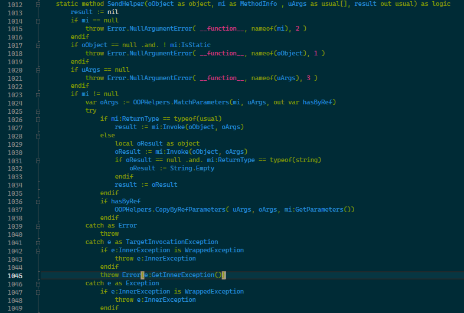
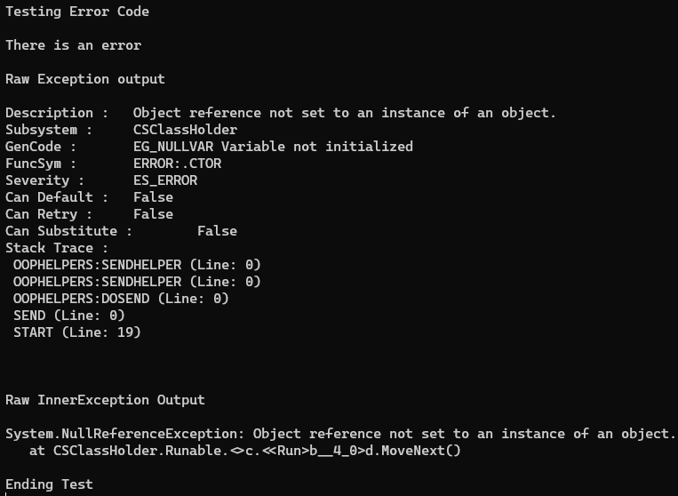
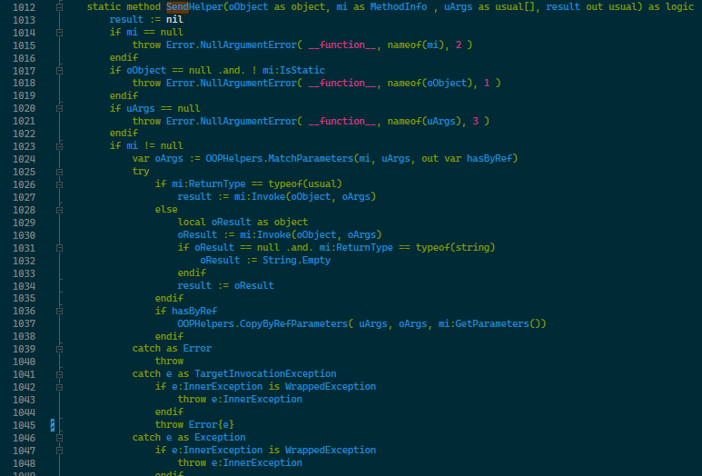
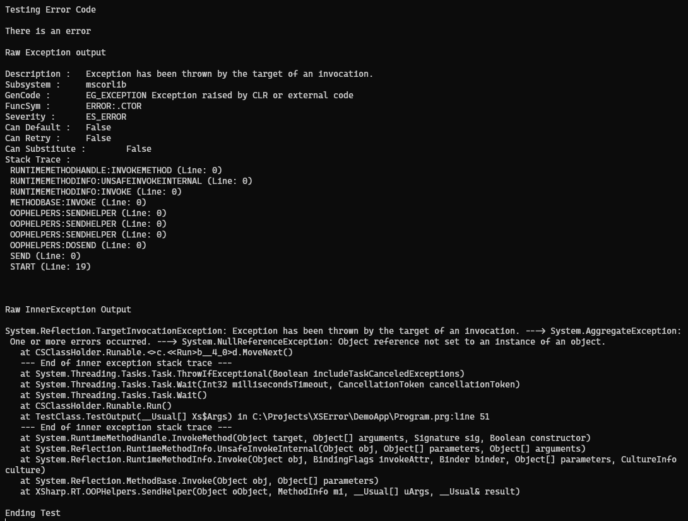
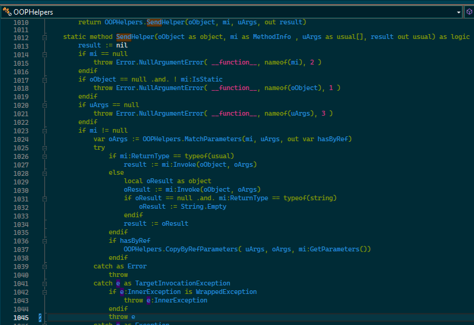
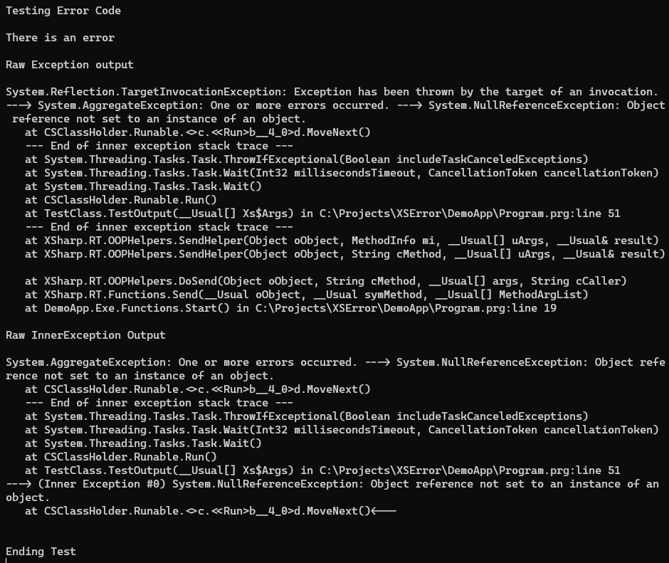

# Demo App to Display Error Object Output
During a recent hunt for an error it was found that the X# code would wrap a thrown error in the `Error` object which was cutting off some of the stack trace. The following demo application highlights the issue, where it was traced to and what information is required yet seems to be discarded.

The main point of focus will be in `SendHelper(oObject as object, mi as MethodInfo , uArgs as usual[], result out usual)` which is found in XSharp.RT => OOP.prg. During operations a `TargetInvocationException` was thrown and caught by `SendHelper`. The InnerException is then passed to the `Error` object which further parses the stack trace and excludes some vital information in hunting for where the error came from.

The DemoApp project has three Solution configurations that help to test this and show what I mean.

1. Test 1 - This configuration uses the orignal code for `SendHelper`
2. Test 2 - This configuration passes the full error into the `Error`object
3. Test 3 - This removes the `Error` object completely and shows the stack trace that should be displayed.

The Example code uses a similar workflow to how the issue was highlighted within our code but isolated as a demonstration.

## Test 1
This configuration uses the original code for `XSharp.RT`. The RT DLL can be found in `.\LocalDlls\Test1` and looks like the following:

Note Line 1045 is what we are interested in here and is the error that is to be displayed. When the Test 1 configuration is outputted, we get the following:

The StackTrace is the issue here. It tells me there is an error, but it is not telling me where to find the error. The Inner Exception that is contained within shows me roughly what error was thrown but it is difficult to extract where it is unless I know exactly what was called and where.

## Test 2
This configuration still uses the `Error` object however the creation of the object is passed the full exception. The RT DLL can be found in `.\LocalDlls\Test2` and looks like the following:

This change outputs the following:

Here there is a little bit more information in the StackTrace outputted by the `Error`object but I am still no closer to knowing what is going on. If I look at the Inner Exception, it shows me a bit more. In particular it shows me line 51 of `Program.prg` which is the `CSClassHolder.Runable.Run()` method that is causing the issue, but I have had to dig into the object class to extract it when it should be part of the original stack trace.

## Test 3
This configuration doesn't use the `Error`object at all and just returns the raw exception. The RT DLL can be found in `.\LocalDlls\Test3` and looks like the following:

This change outputs the following:

This gives the full stack trace needed to actually understand what is causing the error without needing to dig around for it.

## Conclusion
Would it be possible for the `Error` object that is created to display the required information it seems to cut out? From the code there seems to be the `ErrorStack` method that is used to parse the stack that is displayed but I can't explain why it is not returning the correct information for tracing an error.
